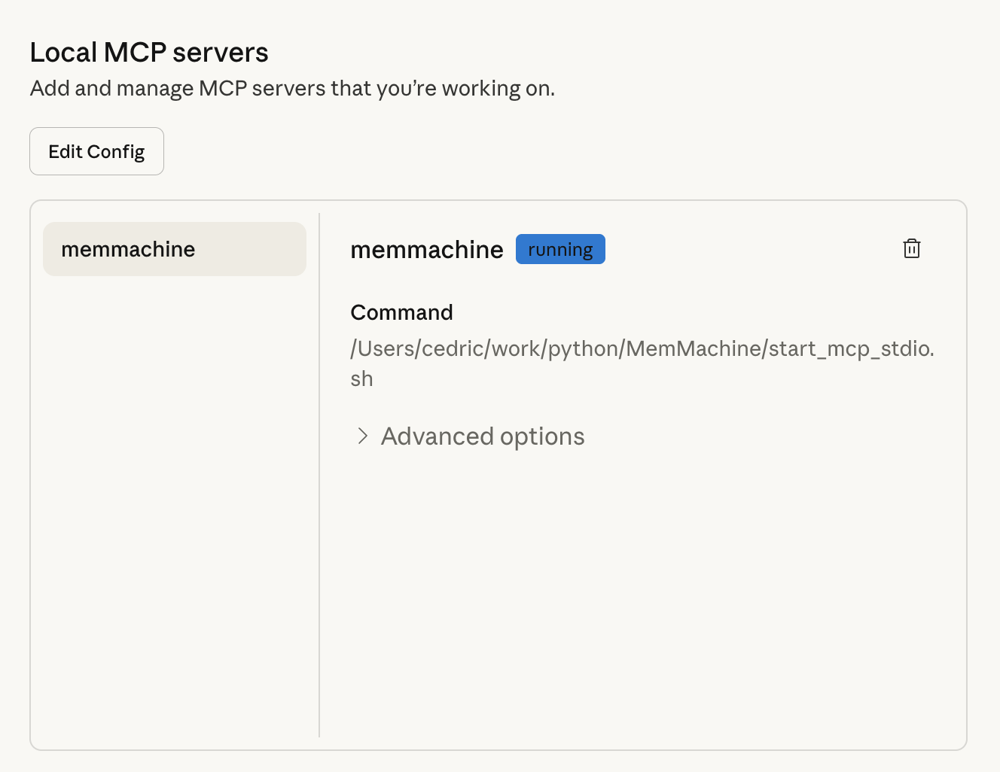
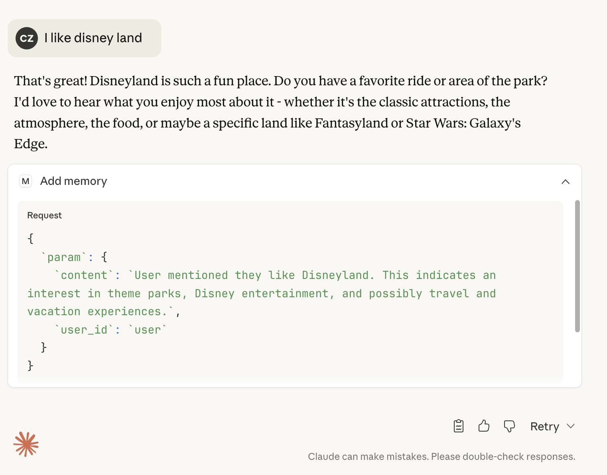
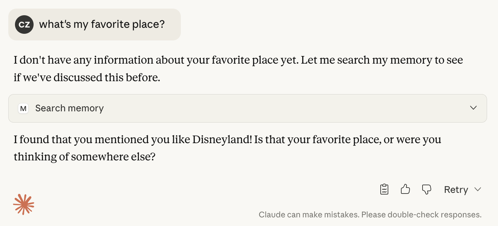

# MCP API Examples
## Hello World: A Guide to the MemMachine MCP Server API

This guide provides a quick and simple way to get started with the MemMachine Model Content Protocol (MCP)
Server API using `curl` commands. It can also be found in our [Quick Start Guide](https://docs.memmachine.ai/getting_started/quickstart).

### Prerequisites

First, ensure your stand alone MCP server is up and running. You can use this sample command to start it:

```
MEMORY_CONFIG=config.yml uv run memmachine-mcp-http --host localhost --port 8080
```

In which `config.yml` is your MemMachine configuration file.  `localhost` and `8080` are the host and port
where the MCP server will listen for requests.


If you want to check that the server is running correctly, you can use following steps to query the tools
available on the server with `curl`.

<Steps>
<Step title="Establish SSE connection and get session ID">

We need a session id to work with the MCP server. We can obtain one by establishing a Server-Sent Events (SSE)
connection.

```
curl -v -N http://localhost:8080/mcp/ -H "Accept: text/event-stream"
```

Here is a sample response you might see:

```
* Host localhost:8080 was resolved.
* IPv6: ::1
* IPv4: 127.0.0.1
*   Trying [::1]:8080...
* connect to ::1 port 8080 from ::1 port 62212 failed: Connection refused
*   Trying 127.0.0.1:8080...
* Connected to localhost (127.0.0.1) port 8080
> GET /mcp/ HTTP/1.1
> Host: localhost:8080
> User-Agent: curl/8.7.1
> Accept: text/event-stream
>
* Request completely sent off
< HTTP/1.1 400 Bad Request
< date: Fri, 31 Oct 2025 21:58:56 GMT
< server: uvicorn
< content-type: application/json
< mcp-session-id: 8f82399b29ba42d495ff44d5a9cf7862
< content-length: 105
<
{"jsonrpc":"2.0","id":"server-error","error":{"code":-32600,"message":"Bad Request: Missing session ID"}}
```

In this output, looking for the `mcp-session-id` header, you can see the session ID is `8f82399b29ba42d495ff44d5a9cf7862`.

</Step>
<Step title="Initialize the session">

Now that we have a session id, we can initialize the session by sending an `initialize` request to the MCP server.

```
curl http://localhost:8080/mcp/ \
  -H "Content-Type: application/json" \
  -H "Accept: application/json, text/event-stream" \
  -H "mcp-session-id: 8f82399b29ba42d495ff44d5a9cf7862" \
  -d '{
    "jsonrpc": "2.0",
    "id": 1,
    "method": "initialize",
    "params": {
      "protocolVersion": "2024-11-05",
      "capabilities": {},
      "clientInfo": {
        "name": "curl-client",
        "version": "1.0.0"
      }
    }
  }'
```

Here is a sample response you might see:

```
event: message
data:
{
  "jsonrpc": "2.0",
  "id": 1,
  "result": {
    "protocolVersion": "2024-11-05",
    "capabilities": {
      "experimental": {},
      "prompts": {
        "listChanged": true
      },
      "resources": {
        "subscribe": false,
        "listChanged": true
      },
      "tools": {
        "listChanged": true
      }
    },
    "serverInfo": {
      "name": "MemMachine",
      "version": "1.16.0"
    }
  }
}
```
</Step>
<Step title="Send initialized notification">
After initializing the session, we need to send an `initialized` notification to the MCP server.

```
curl http://localhost:8080/mcp/ \
  -H "Content-Type: application/json" \
  -H "Accept: application/json, text/event-stream" \
  -H "mcp-session-id: 8f82399b29ba42d495ff44d5a9cf7862" \
  -d '{
    "jsonrpc": "2.0",
    "method": "notifications/initialized"
  }'
```
The request should succeed without any errors.
</Step>
<Step title="List available tools">
Now we can list the available tools by sending a `tools/list` request to the MCP server.

```
curl http://localhost:8080/mcp/   \
    -H "Content-Type: application/json" \
    -H "Accept: application/json, text/event-stream" \
    -H "mcp-session-id: 8f82399b29ba42d495ff44d5a9cf7862"   -d '{
    "jsonrpc": "2.0",
    "id": 2,
    "method": "tools/list",
    "params": {}
  }'
```

Here is a sample response you might see:

```
event: message
data:
{
  "jsonrpc": "2.0",
  "id": 2,
  "result": {
    "tools": [
      {
        "name": "add_memory",
        "description": "Store important new information about the user or conversation into memory. Use this automatically whenever the user shares new facts, preferences, plans, emotions, or other details that could be useful for future context. Include the **full conversation context** in the `content` field — not just a snippet. This tool writes to both short-term (episodic) and long-term (profile) memory, so that future interactions can recall relevant background knowledge even across different sessions.",
        "inputSchema": {
          "$defs": {
            "AddMemoryParam": {
              "description": "Parameters for adding memory.\n\nThis model is used by chatbots or agents to store important information\ninto memory for a specific user. The content should contain the **full\nconversational or contextual summary**, not just a short fragment.\n\nChatbots should call this when they learn new facts about the user,\nobserve recurring behaviors, or summarize recent discussions.",
              ...
}
```


</Step>
</Steps>

### Working with Claude Desktop App

The Claude Desktop App allows the developer to easily interact with the MCP server.

To configure the Claude Desktop App to connect to your MCP server, follow these steps:

1. Open the Claude Desktop App.

2. Navigate to the settings section.

3. Navigate to the `Developer` tab.

4. Click `Edit Config` and it will pop up the location of the configuration file.

5. The configuration file is named `claude_desktop_config.json`.  Edit the file to include the MCP stdio mode.

```
{
  "mcpServers": {
    "memmachine": {
      "command": "MEMORY_CONFIG=config.yml MM_USER_ID="user" uv run memmachine-mcp-stdio",
      "env": {
        "PYTHONUNBUFFERED": "1"
      }
    }
  }
}
```

In which `config.yml` is your MemMachine configuration file.  `user` is the user ID you want to use for the session.

6. If you installed MemMachine as a python package, you can replace the command with:

```
MEMORY_CONFIG=config.yml MM_USER_ID="user" memmachine-mcp-stdio
```

7. Save the configuration file and restart the Claude Desktop App.

8. If you navigate to the `Developer` tab again, you should see `memmachine` as an option in the `MCP Server` dropdown.



9. If you want to connect to a MCP running in HTTP mode.  You can replace the configuration with this:

```
{
  "mcpServers": {
    "memmachine-http": {
      "command": "/Users/cedric/.nvm/versions/node/v20.19.5/bin/npx",
      "args": [
        "mcp-remote",
        "http://localhost:8080/mcp",
        "--header",
        "user-id: user"
      ]
    }
  }
}
```

In which `localhost` and `8080` are the host and port where your MCP server is running.
`user` is the user ID you want to use for the session.
Note that you need node v20+ and npx installed to use the `mcp-remote` command.  It basically acts as a proxy between
the Claude Desktop App and the MCP HTTP server.

10. If something went wrong, you will see an error message popup when you start Claude Desktop App.
You can also check the logs by clicking on `View Logs` button in the `Developer` tab.

11. Now we can go back to the main screen and start a new conversation. You can say something like "I like Disneyland"
and Claude should be able to remember that in the next conversation.  You may need to allow the model to call MCP for
the first time.



12. Restart the Claude Desktop App and start a new conversation.  Ask about your favorite places and see if Claude can
remember them.


